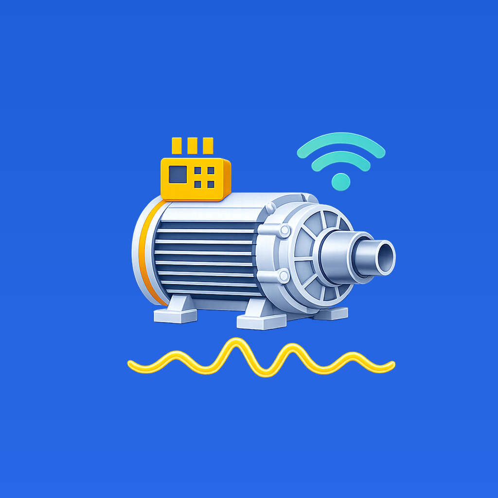
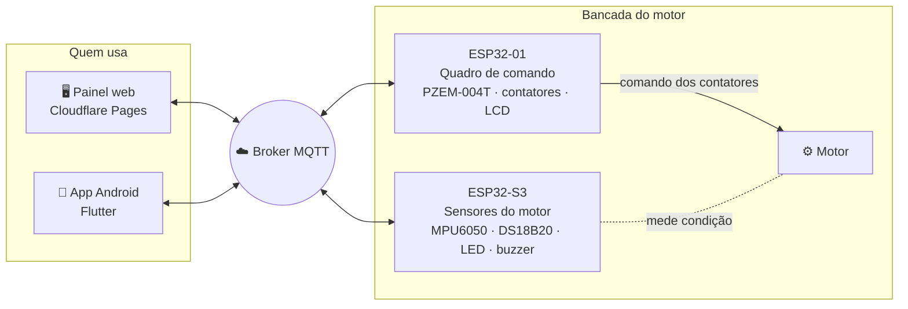

<div align="center">



# IoTMotor

**Monitoramento, comando e acompanhamento de motores elétricos pela internet**<br>
Painel web, app Android e dois ESP32 integrados por MQTT.

[](https://github.com/frahncky/IoTMotor/actions/workflows/cloudflare-dashboard.yml)
[](https://github.com/frahncky/IoTMotor/actions/workflows/esp32-compile.yml)
[](https://github.com/frahncky/IoTMotor/actions/workflows/android-apk.yml)

[**🖥️ Abrir o painel**](https://iotmotor.pages.dev) &nbsp;·&nbsp;
[**📱 Baixar o app (APK)**](https://github.com/frahncky/IoTMotor/releases/download/app-latest/IoTMotor.apk) &nbsp;·&nbsp;
[**🔧 Firmware das placas**](https://github.com/frahncky/IoTMotor/releases/tag/firmware-latest)


</div>

---

## ✨ O que ele faz

| | |
| --- | --- |
| ⚡ **Monitoramento elétrico** | Tensão, corrente, potências, fator de potência, frequência e energia pelo PZEM-004T. |
| 🌡️ **Condição do motor** | Temperatura por DS18B20 e vibração por MPU6050, com velocidade RMS em mm/s, tendência de condição, alarmes configuráveis e metodologia documentada. |
| ⏱️ **Aquisição sincronizada** | O ESP32-01 centraliza os intervalos de leitura elétrica, publicação MQTT, pontos dos gráficos e registro; web, app e ESP32-S3 usam a mesma configuração. |
| ▶️ **Comando e partidas** | Acionamento remoto e perfis como partida direta e estrela-triângulo, gravados no quadro de comando. |
| 🧾 **Uso e manutenção** | Dados de placa, carga em % da corrente nominal, horímetro, partidas e lembrete de manutenção. |
| 📈 **Histórico na própria bancada** | Médias e máximos por hora, com histórico de 7 dias retido na placa mesmo sem o painel aberto. |
| 📱 **Painel web e app Android** | Controle, telemetria, animação do motor, som opcional, diagnóstico e atualização do app. No Android, a área de medições reúne cartões compactos com ícone, nome e tendência no topo e o valor em destaque na parte inferior. |
| 🔔 **Alertas no celular** | Opcional: o app avisa quando um alarme da placa dispara, mesmo fechado. |
| 🔄 **Atualização remota** | Firmware dos dois ESP32 pode ser atualizado pelo painel ou pelo app, sem nova gravação por cabo. |
| 🔐 **Segurança opcional** | Quando uma senha é configurada nas placas, os comandos são cifrados e autenticados com AES-256-GCM. |

## 🖼️ Telas

<table>
  <tr>
    <td></td>
  </tr>
  <tr>
    <td></td>
  </tr>
</table>

## 🧭 Arquitetura do sistema

O IoTMotor divide as funções entre duas placas:

- **ESP32-01 — quadro de comando:** grandezas elétricas, contatores, partidas, LCD, dados do motor e horímetro.
- **ESP32-S3 — sensores do motor:** vibração, temperatura, LED RGB, buzzer e diagnóstico de condição.
- **Painel web e app Android:** visualização, configuração e comandos remotos.
- **MQTT:** transporte da telemetria, estados e comandos entre as interfaces e a bancada.



As placas publicam telemetria e também mantêm dados importantes localmente, como perfis de partida, alarmes, dados do motor e histórico. O ESP32-01 é a autoridade da configuração de aquisição: grava os intervalos em NVS e publica a configuração de forma retida para o painel, o app e o ESP32-S3. O painel e o app utilizam essas informações para representar o estado confirmado da bancada e enviar comandos.

## 🔌 Hardware

| Placa | Função | Firmware |
| --- | --- | --- |
| **ESP32-01** · quadro de comando | PZEM-004T, contatores CNT 1 a 4, LCD 20×4, horímetro e dados do motor | [`iotmotor_esp32_comandos`](esp32/iotmotor_esp32/iotmotor_esp32_comandos) |
| **ESP32-S3** · sensores do motor | MPU6050 (vibração), DS18B20 (temperatura), LED RGB, buzzer, alarmes e histórico | [`iotmotor_esp32_s3_sensores`](esp32/iotmotor_esp32/iotmotor_esp32_s3_sensores) |

## 🚀 Começando

1. **Grave as placas** uma vez pelo cabo, com os sketches acima (Arduino IDE). Depois disso, as novas versões de firmware podem ser instaladas remotamente.
2. **Abra o painel** em [iotmotor.pages.dev](https://iotmotor.pages.dev) e toque em **Conectar**.
3. **Instale o app Android** pelo [APK](https://github.com/frahncky/IoTMotor/releases/download/app-latest/IoTMotor.apk). As próximas versões podem ser verificadas e instaladas pelo próprio app.

## 🗂️ Estrutura

```text
dashboard-cloudflare/   Painel web (HTML + JS, sem build) e testes
functions/              Ponte MQTT na porta 443 (Cloudflare Pages Functions)
esp32/iotmotor_esp32/   Firmware das duas placas
lib/                    App Flutter
test/                   Testes do app
docs/                   Documentação técnica e imagens
```

## 📚 Documentação

| | |
| --- | --- |
| 📘 [Guia de uso](docs/guia-de-uso.md) | Operar a bancada pelo painel e pelo app |
| 📡 [Referência MQTT](docs/mqtt.md) | Tópicos, telemetria e comandos |
| 🔌 [Hardware](docs/hardware.md) | Materiais e ligações das duas placas |
| 🔧 [Firmware](docs/firmware.md) | Gravar, atualizar e configurar as placas |
| 📐 [Vibração](docs/vibracao.md) | Cálculo de mm/s RMS, filtros, montagem, validação e limitações |
| 🔊 [Áudio do motor](docs/audio.md) | Origem do som, processamento para web/app e arquivos derivados |
| 🛠️ [Desenvolvimento](docs/desenvolvimento.md) | Estrutura, testes, CI e publicação |

## 🎓 Escopo do projeto

O IoTMotor foi desenvolvido como **plataforma didática e de pesquisa** para estudo de acionamento, monitoramento, instrumentação, IoT e manutenção de motores elétricos.

> [!WARNING]
> O sistema não substitui proteções elétricas, intertravamentos físicos, dispositivos de parada de emergência nem procedimentos de segurança exigidos para instalações industriais reais.
