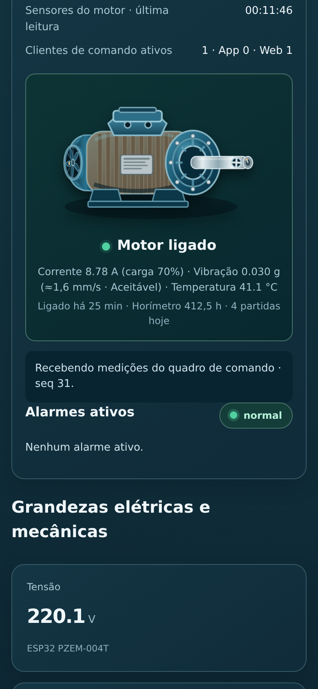
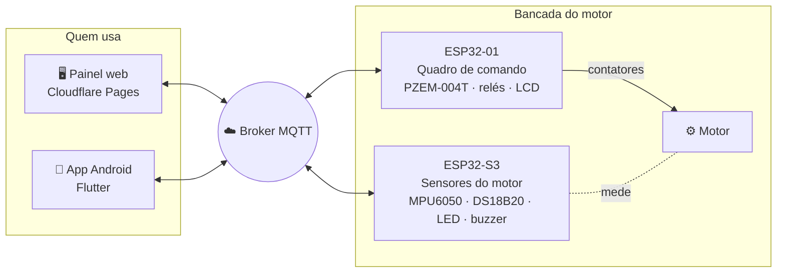

<div align="center">


# IoTMotor

**Monitoramento e comando de motores elétricos pela internet**<br>
Painel web, app Android e dois ESP32 conversando por MQTT.

[](https://github.com/frahncky/IoTMotor/actions/workflows/cloudflare-dashboard.yml)
[](https://github.com/frahncky/IoTMotor/actions/workflows/esp32-compile.yml)
[](https://github.com/frahncky/IoTMotor/actions/workflows/android-apk.yml)

[**🖥️ Abrir o painel**](https://iotmotor.pages.dev) &nbsp;·&nbsp;
[**📱 Baixar o app (APK)**](https://github.com/frahncky/IoTMotor/releases/download/app-latest/IoTMotor.apk) &nbsp;·&nbsp;
[**🔧 Firmware das placas**](https://github.com/frahncky/IoTMotor/releases/tag/firmware-latest)


</div>

---

## ✨ O que ele faz

| | |
| --- | --- |
| ⚡ **Medições elétricas** | Tensão, corrente, potências, fator de potência, frequência e energia (PZEM-004T). |
| 🌡️ **Temperatura e vibração** | DS18B20 e MPU6050 no motor, com a vibração classificada pela ISO 10816 (Boa, Aceitável, Alerta, Crítica). |
| ▶️ **Partidas pela internet** | Partida direta ou estrela-triângulo, montadas no painel e gravadas no quadro de comando. |
| 🚨 **Alarmes na placa** | LED e buzzer na placa de sensores. Os limites ficam gravados nela e funcionam com o painel fechado. |
| 🧾 **Dados do motor** | Placa de identificação (inclusive dupla tensão 220/380 V), carga em % e alarmes sugeridos de sobrecarga, tensão e partidas. |
| ⏱️ **Horímetro e manutenção** | Horas de uso, partidas por dia e lembrete de manutenção pelo horímetro. |
| 📈 **Histórico de 7 dias** | Médias e máximos de cada hora, guardados na própria placa. |
| 🔄 **Atualização remota** | Os dois ESP32 baixam o firmware novo pelo painel ou pelo app, sem cabo. |
| 🔐 **Comandos cifrados** | Com senha, os comandos saem cifrados (AES-256-GCM), mesmo em broker público. |

## 🖼️ Telas

<table>
  <tr>
    <td width="68%"></td>
    <td rowspan="2" width="32%"></td>
  </tr>
  <tr>
    <td></td>
  </tr>
</table>

## 🧭 Como funciona



- As placas publicam a telemetria e os dados retidos (partidas, alarmes, dados do motor, histórico). O painel e o app só leem e comandam pelo broker.
- A placa de sensores também ouve o quadro de comando: os alarmes de corrente e tensão tocam no mesmo LED e buzzer.

## 🔌 Hardware

| Placa | Função | Firmware |
| --- | --- | --- |
| **ESP32-01** · quadro de comando | PZEM-004T, contatores CNT 1 a 4, LCD 20×4, horímetro e dados do motor | [`iotmotor_esp32_comandos`](esp32/iotmotor_esp32/iotmotor_esp32_comandos) |
| **ESP32-S3** · sensores do motor | MPU6050 (vibração), DS18B20 (temperatura), LED RGB, buzzer, alarmes e histórico | [`iotmotor_esp32_s3_sensores`](esp32/iotmotor_esp32/iotmotor_esp32_s3_sensores) |

## 🚀 Começando

1. **Grave as placas** uma vez pelo cabo, com os sketches acima (Arduino IDE). Depois disso, as atualizações chegam pela aba **Dispositivos**.
2. **Abra o painel** em [iotmotor.pages.dev](https://iotmotor.pages.dev) e toque em **Conectar**.
3. **Instale o app** pelo [APK](https://github.com/frahncky/IoTMotor/releases/download/app-latest/IoTMotor.apk). Para as próximas versões, use **Configurações › Atualizar este app**.

## 🗂️ Estrutura

```text
dashboard-cloudflare/   Painel web (HTML + JS, sem build) e testes
functions/              Ponte MQTT na porta 443 (Cloudflare Pages Functions)
esp32/iotmotor_esp32/   Firmware das duas placas
lib/                    App Flutter
test/                   Testes do app
docs/                   Documentação técnica e imagens
```

## 📚 Documentação

- [Painel web, MQTT e ponte na porta 443](dashboard-cloudflare/README.md)
- [Placa de sensores (ESP32-S3)](esp32/iotmotor_esp32/iotmotor_esp32_s3_sensores/README.md)
- [App: conexão, telemetria e armazenamento](docs/app-mqtt.md)

> [!WARNING]
> Projeto de **bancada didática**. O broker público aceita mensagens de qualquer pessoa, e os relés indicam o estado comandado, não a energização real. Para máquinas reais, use parada de emergência independente, proteções elétricas e intertravamentos físicos.
