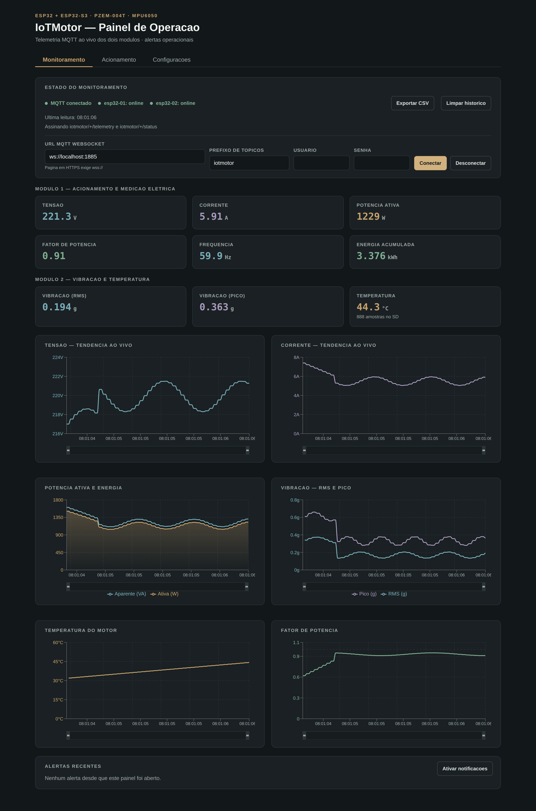

# Dashboard IoTMotor

Painel web em React + Vite para operar e acompanhar os dois modulos ESP32 do
IoTMotor. Segue o mesmo modelo do dashboard do projeto E-Metrics IoT: o painel
nao fala com o ESP32 pela rede local, e sim com o **broker MQTT**, pelo listener
WebSocket seguro.



*(captura gerada com dados simulados por um broker local, durante os testes)*

## Por que WebSocket

O firmware publica em `mqtt://test.mosquitto.org:1883` (TCP puro). O navegador
nao abre socket TCP, entao o painel assina os mesmos topicos por
`wss://test.mosquitto.org:8081`. Quem faz a ponte e o broker.

O `wss://` e obrigatorio quando a pagina esta em HTTPS: o navegador bloqueia
`ws://` a partir de uma origem segura (mixed content). Em desenvolvimento local
(`http://localhost`) o `ws://` funciona.

## Rodar localmente

```bash
cd dashboard_iotmotor
npm install
npm run dev
```

O Vite sobe em `http://localhost:5173`. Ajuste a URL do broker e o prefixo de
topicos no proprio painel, na aba Monitoramento — os valores ficam no
`localStorage` do navegador (a senha nao e guardada).

## Testes

```bash
npm test
```

Cobrem o parser de telemetria, o roteamento por topico e o formato dos comandos
publicados, que precisa bater exatamente com o que o firmware espera.

## Deploy no Cloudflare Pages

### Opcao 1: pela CLI

```bash
cd dashboard_iotmotor
npm run build:cloudflare
npm run deploy:cloudflare
```

Na primeira execucao a CLI pede autenticacao e o nome do projeto. Sugestao:
`iotmotor-dashboard`.

### Opcao 2: deploy continuo via GitHub

1. No Cloudflare, acesse `Workers & Pages` > `Create` > `Pages` > `Connect to Git`.
2. Selecione o repositorio `IoTMotor`.
3. Configure:
   - Root directory: `dashboard_iotmotor`
   - Build command: `npm run build`
   - Build output directory: `dist`

Cada push na branch conectada republica o painel.

### Dominio personalizado

Depois de publicar, em `Custom domains`, conecte seu dominio.

## O que o painel faz

| Aba | Conteudo |
|---|---|
| Monitoramento | Cards dos dois modulos, graficos ao vivo, alertas, exportacao CSV |
| Acionamento | Partida direta, estrela-triangulo, parada, estado e trava de protecao |
| Configuracoes | Retencao do SD do Modulo 2, leitura sob demanda, limites de alerta |

### Topicos usados

Assina `<prefixo>/+/telemetry` e `<prefixo>/+/status`, e roteia por `device_id`
extraido do topico. Publica em:

| Acao | Topico | Payload |
|---|---|---|
| Comando direcionado | `<prefixo>/esp32-01/command` | `{device_id, command, mode, origin, timestamp}` |
| Comando em broadcast | `<prefixo>/request/command` | `{type:"command_request", ...}` |
| Retencao do SD | `<prefixo>/request/command` | `{type:"storage_config", ...}` |
| Leitura sob demanda | `<prefixo>/request/telemetry` | `{type:"telemetry_request", ...}` |

Os formatos sao os mesmos de `MqttMotorService` no app Flutter, para que painel e
aplicativo comandem os modulos de forma identica.

## Aviso sobre o broker publico

`test.mosquitto.org` e aberto: nao tem usuario nem senha, e qualquer pessoa que
descubra o prefixo de topicos pode publicar em `iotmotor/esp32-01/command` e
**partir o motor**. Para bancada de laboratorio isso costuma ser aceitavel; para
uso permanente, troque por um broker com autenticacao e TLS.

Uma medida simples enquanto o broker for publico: trocar o prefixo `iotmotor`
por algo dificil de adivinhar (ex.: `iotmotor-ifma-7f3a`) nos tres lugares —
firmware dos dois modulos, app Flutter e este painel.
