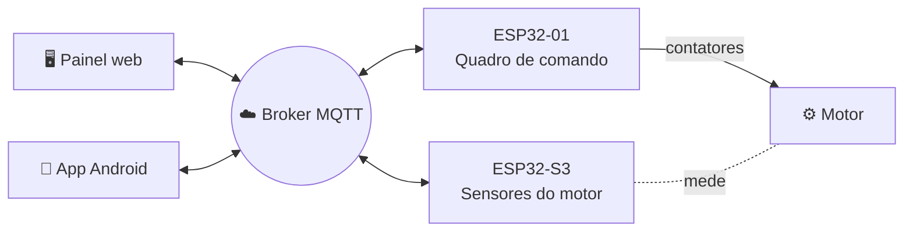

# Documentação do IoTMotor

| Documento | Para quem | O que tem |
| --- | --- | --- |
| 📘 [Guia de uso](guia-de-uso.md) | Quem opera a bancada | Conectar, dar partida, alarmes, dados do motor, manutenção, histórico, atualizar as placas, app |
| 📡 [Referência MQTT](mqtt.md) | Quem integra outro sistema | Tópicos, campos da telemetria, mensagens retidas, cada comando e os motivos de recusa |
| 🔌 [Hardware](hardware.md) | Quem monta | Lista de materiais, pinos das duas placas, LED, buzzer |
| 🔧 [Firmware](firmware.md) | Quem grava as placas | Primeira gravação, OTA, versões, partições, Wi-Fi, senha de comando |
| 🛠️ [Desenvolvimento](desenvolvimento.md) | Quem programa | Estrutura, testes, simuladores, CI, publicação do painel, do firmware e do app |

## Visão geral

- O **quadro de comando** mede a energia (PZEM-004T), aciona os contatores e guarda as partidas, os dados do motor e o horímetro.
- A **placa de sensores** mede vibração e temperatura, cuida dos alarmes (LED e buzzer) e guarda o histórico de 7 dias.
- O **painel** e o **app** só leem e comandam pelo broker. Tudo o que precisa sobreviver fica gravado nas placas.
