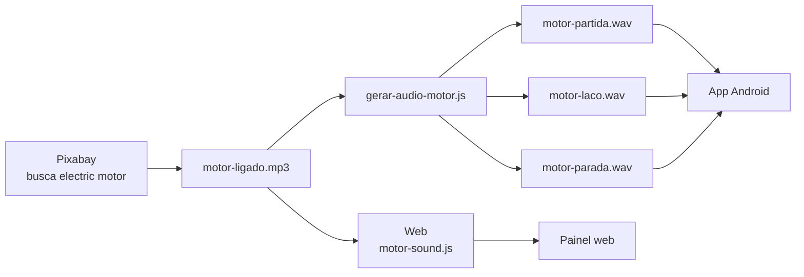

# Áudio do motor

Este documento registra a **origem e o processamento do som real do motor**
usado pelo IoTMotor, para que essa informação não se perca com o tempo.

## Origem

O arquivo-base usado no projeto foi obtido no **Pixabay**, a partir da página de
busca de efeitos sonoros para **electric motor**:

https://pixabay.com/pt/sound-effects/search/electric-motor/

No repositório, a gravação original é usada com o nome:

```text
dashboard-cloudflare/motor-ligado.mp3
```

> [!IMPORTANT]
> O link acima é a página de busca informada como origem do áudio. O projeto
> ainda não tem registrado o **URL exato do item**, o **nome do efeito** nem o
> **nome do autor/contribuidor**. Se essas informações forem recuperadas depois,
> devem ser acrescentadas aqui e em `THIRD_PARTY_NOTICES.md`.

## Licença

Na data desta documentação, a **Pixabay Content License** informa que o conteúdo
pode, sujeito aos usos proibidos da licença, ser usado gratuitamente,
modificado/adaptado e utilizado sem atribuição obrigatória; crédito ao autor é
apreciado.

Como os termos podem mudar, para qualquer redistribuição ou uso futuro deve-se
consultar a licença vigente no Pixabay:

https://pixabay.com/service/license-summary/

O IoTMotor não redistribui o áudio apenas como item isolado: ele é incorporado
e processado como parte da interface web e do aplicativo.

## Como o áudio é usado na web

O arquivo `motor-ligado.mp3` é carregado por:

```text
dashboard-cloudflare/motor-sound.js
```

A gravação é dividida logicamente em três momentos:

| Trecho | Intervalo atual | Uso |
| --- | ---: | --- |
| Partida | 0 a ~1 s | estalo/entrada e início da aceleração |
| Regime | ~1,00 a 3,55 s | trecho repetido enquanto o motor está ligado |
| Parada | ~3,70 s até o fim | estalos e desaceleração |

O trecho em regime recebe uma pequena fusão (*crossfade*) de aproximadamente
**0,25 s** para reduzir a percepção da emenda no laço.

Se o MP3 não puder ser carregado, a web possui um **som sintetizado de
fallback**, construído com Web Audio API a partir de componentes aproximadas de:

- zumbido elétrico em 60/120 Hz;
- rotação aproximada do rotor;
- passagem das pás da ventoinha;
- ruído de ar;
- componente discreta de rolamentos.

Assim, o som real do Pixabay é o áudio preferencial; o sintetizado é uma
alternativa de contingência.

## Como o áudio é usado no app Android

Para evitar pausas perceptíveis no laço do Android, a gravação-base é
pré-processada pelo script:

```text
tools/gerar-audio-motor.js
```

Esse script usa o mesmo processamento do painel e gera:

```text
assets/audio/motor-partida.wav
assets/audio/motor-laco.wav
assets/audio/motor-parada.wav
```

| Arquivo | Função |
| --- | --- |
| `motor-partida.wav` | início/partida do motor |
| `motor-laco.wav` | trecho estável repetido em memória |
| `motor-parada.wav` | desligamento e desaceleração |

O serviço Android responsável pela reprodução é:

```text
lib/features/iot_motor/services/motor_sound_service.dart
```

O laço é reproduzido em modo de baixa latência para minimizar a pausa que
ocorria quando o player reiniciava o arquivo.

## Fluxo do áudio



## Regras de manutenção

Ao trocar a gravação do motor:

1. registrar aqui a nova origem, URL exata, autor e licença;
2. substituir `dashboard-cloudflare/motor-ligado.mp3`;
3. revisar os pontos de corte em `motor-sound.js`;
4. executar `tools/gerar-audio-motor.js`;
5. atualizar os três WAVs em `assets/audio/`;
6. testar partida, laço contínuo e parada na web e no app;
7. confirmar que o som para quando o app fica em segundo plano ou perde a
   conexão com o estado confirmado do motor;
8. atualizar `THIRD_PARTY_NOTICES.md` se a origem/licença mudar.

## Registro resumido

| Item | Registro |
| --- | --- |
| Fonte | Pixabay |
| Página informada | `/pt/sound-effects/search/electric-motor/` |
| Arquivo-base no projeto | `dashboard-cloudflare/motor-ligado.mp3` |
| Uso web | gravação real com laço processado; síntese como fallback |
| Uso app | WAVs derivados de partida, laço e parada |
| URL exata do efeito | ainda não registrada |
| Autor/contribuidor | ainda não registrado |
| Licença | verificar Pixabay Content License vigente |
