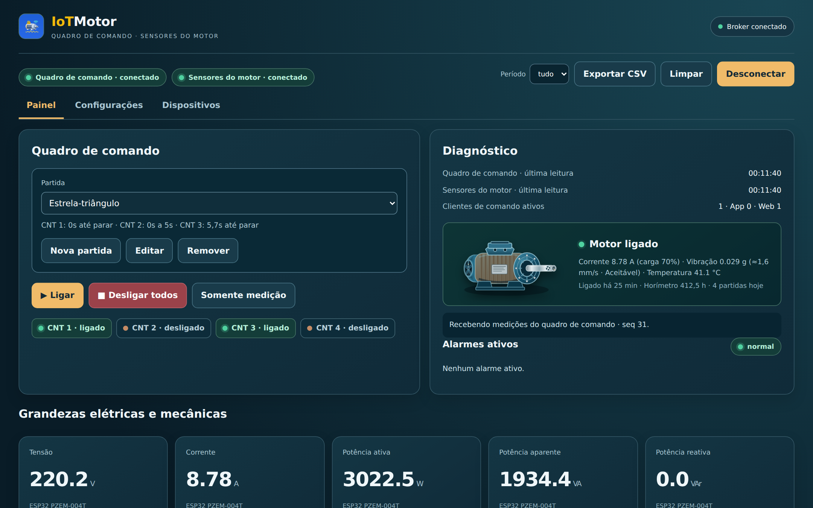
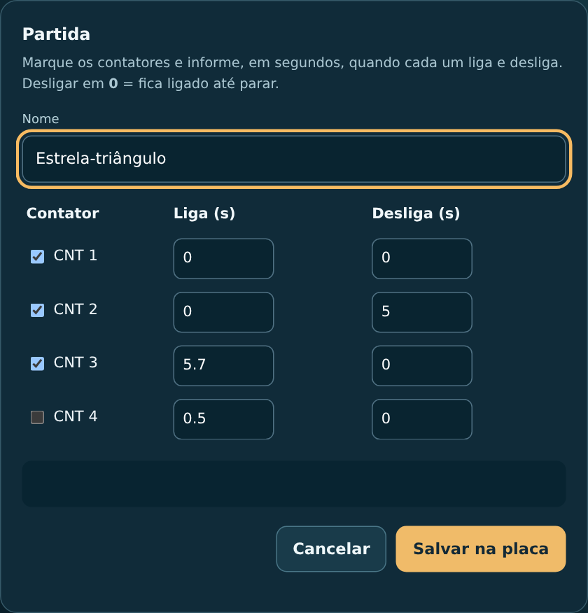
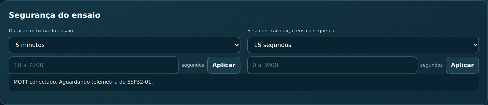
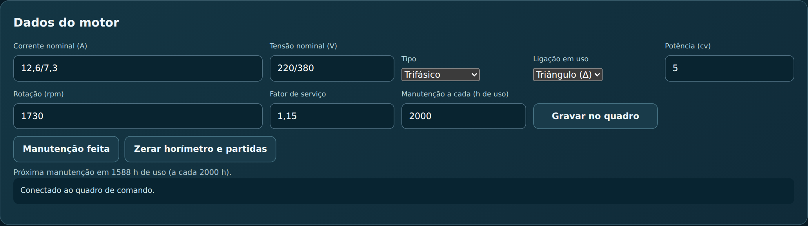
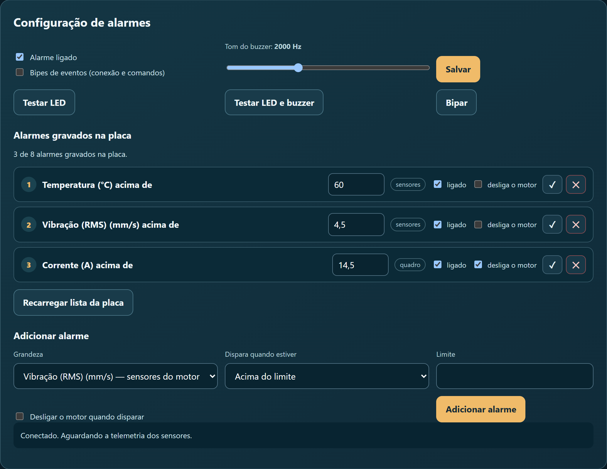
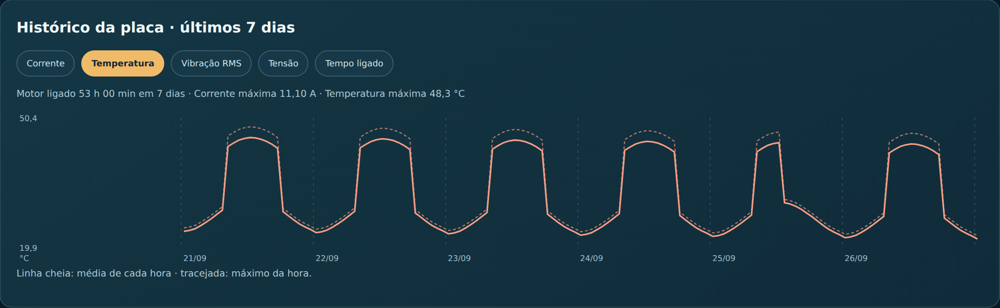
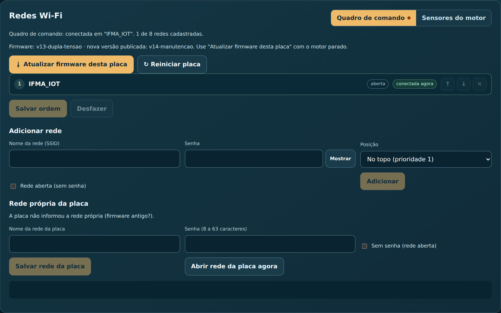

# Guia de uso

Como operar a bancada pelo painel web e pelo app. Para os detalhes técnicos de
cada mensagem, veja a [referência MQTT](mqtt.md).

## Sumário

- [Abrir e conectar](#abrir-e-conectar)
- [A tela Painel](#a-tela-painel)
- [Aquisição e registro de dados](#aquisição-e-registro-de-dados)
- [Dar partida no motor](#dar-partida-no-motor)
- [Somente medição (modo instrumentação)](#somente-medição-modo-instrumentação)
- [Dados do motor e manutenção](#dados-do-motor-e-manutenção)
- [Alarmes](#alarmes)
  - [Desarme automático](#desarme-automático)
- [Histórico](#histórico)
- [Placas: Wi-Fi, atualização e reinício](#placas-wi-fi-atualização-e-reinício)
- [Senha de comando](#senha-de-comando)
- [App Android](#app-android)
  - [Alertas no celular](#alertas-no-celular)
- [Problemas comuns](#problemas-comuns)

## Abrir e conectar

1. Abra [iotmotor.pages.dev](https://iotmotor.pages.dev), no computador ou no celular.
2. Toque em **Conectar**, no topo.
3. Os selos **Quadro de comando** e **Sensores do motor** ficam verdes ("conectado") quando cada placa está mandando dados.

O endereço do broker, o prefixo e o ID de cada placa ficam em
**Configurações › Conexão MQTT**. O padrão serve para a bancada do IFMA. O
endereço `wss://iotmotor.pages.dev/mqtt` passa pela porta 443 e funciona mesmo
na rede da escola.

| Selo | Significado |
| --- | --- |
| verde · conectado | Dados chegando agora |
| âmbar · online, aguardando dados | A placa está na rede, mas ainda não mandou telemetria |
| vermelho · desconectado | A placa caiu ou está sem dados há mais de 6 s |

## A tela Painel

- **Quadro de comando:** escolha da partida, os botões **Ligar**, **Desligar** e **Somente medição**, e o estado de CNT 1 a CNT 4.
- **Diagnóstico:** o desenho do motor e, abaixo dele, as medições principais:
  - corrente e **carga em %**, quando a corrente nominal está cadastrada;
  - vibração em **mm/s RMS** com a classificação de referência do projeto (com o motor ligado);
  - temperatura;
  - uma linha de uso: *Ligado há…*, horímetro e partidas de hoje.
- **Alarmes ativos:** o que está disparado agora, sensores sem leitura, grandezas perto do limite e manutenção vencida ou próxima.
- **Grandezas elétricas e mecânicas** e **Gráficos em tempo real:** todas as medições, na cadência definida em **Aquisição e registro de dados**.
- **Histórico da placa:** os últimos 7 dias, hora a hora (veja [Histórico](#histórico)).

A grandeza mostrada é **velocidade de vibração RMS em mm/s**. A placa de
sensores lê o MPU6050 a 1000 amostras/s, filtra, integra a aceleração para
velocidade, calcula o RMS de X/Y/Z e usa o maior eixo da janela de 1 s.

O painel e o app também exibem **Boa, Aceitável, Alerta ou Crítica** segundo
faixas de referência implementadas no projeto:

| Potência cadastrada | Boa | Aceitável | Alerta | Crítica |
| --- | --- | --- | --- | --- |
| até 15 kW | < 0,71 | 0,71 a < 1,8 | 1,8 a < 4,5 | ≥ 4,5 mm/s |
| >15 até 75 kW | < 1,12 | 1,12 a < 2,8 | 2,8 a < 7,1 | ≥ 7,1 mm/s |
| acima de 75 kW | < 1,8 | 1,8 a < 4,5 | 4,5 a < 11,2 | ≥ 11,2 mm/s |

Esses rótulos são **indicadores operacionais do IoTMotor**, não um laudo ou
certificação normativa. A ISO 20816-3 possui escopo e requisitos próprios de
máquina, ponto de medição, operação e instrumentação; para avaliação formal,
use a edição vigente e instrumento/procedimento adequados.

A faixa útil do processamento atual é aproximadamente **10–180 Hz**. Ela é
adequada para acompanhamento de tendência em bancada, mas não substitui um
analisador de vibração de banda mais larga ou análise espectral de rolamentos e
engrenagens.

O método completo — filtros, integração trapezoidal, RMS, critérios de validade,
montagem e validação experimental — está em [**Vibração: medição, processamento
e interpretação**](vibracao.md).

Só a velocidade em mm/s é usada pelas interfaces e alarmes atuais. O firmware
de sensores antigo (antes da `s3-sensors-1.10`) enviava aceleração em g; com
ele a vibração atual fica sem leitura até atualizar a placa.

## Aquisição e registro de dados

Em **Configurações › Aquisição**, painel e app mostram a mesma configuração,
gravada no **ESP32-01**. Ao conectar, a configuração já salva é carregada
automaticamente; alterar em uma interface passa a valer também para a outra e
para o ESP32-S3.

| Perfil | PZEM | MQTT | Gráfico | Registro |
| --- | ---: | ---: | ---: | ---: |
| **Tempo real** | 1 s | 1 s | 1 s | 1 s |
| **Monitoramento** | 1 s | 2 s | 2 s | 5 s |
| **Econômico** | 5 s | 5 s | 5 s | 30 s |
| **Personalizado** | 1–10 s | 1–60 s | MQTT–60 s | MQTT–600 s |

- **Aquisição elétrica:** intervalo entre leituras do PZEM no ESP32-01.
- **Publicação MQTT:** intervalo entre mensagens de telemetria das duas placas.
- **Pontos do gráfico:** intervalo visual dos gráficos.
- **Registro de dados:** cadência lógica usada para guardar amostras no histórico local do painel/app.
- A leitura do PZEM não pode ser mais lenta que a publicação MQTT; gráfico e registro não podem ser mais rápidos que a fonte MQTT.

A vibração é tratada separadamente: o MPU6050 continua a **1000 amostras/s**,
com janela RMS fixa de **1 s**, independentemente do perfil escolhido. Alterar a
publicação não reduz a frequência física usada no cálculo da vibração.

Os gráficos usam **janelas temporais exatas**. Por exemplo, com 5 s, os pontos
ficam alinhados em `:00`, `:05`, `:10`, `:15` etc. As amostras reais
recebidas dentro de cada janela são consolidadas; o sistema não inventa pontos
intermediários para preencher atrasos do MQTT.

## Dar partida no motor

1. No quadro **Quadro de comando**, escolha a partida (por exemplo, *Estrela-triângulo*).
2. Toque em **Ligar**. O título do card mostra **Ligando…** até a placa confirmar.
3. Para parar, toque em **Desligar**. Esse botão funciona **sempre**, mesmo durante uma partida em andamento.

As partidas ficam gravadas no quadro de comando, até 6. São as mesmas no painel e
no app. Para criar ou mudar uma, use **Nova partida** ou **Editar**:

- Marque os contatores usados.
- **Liga (s):** quando o contator liga, contado a partir do Ligar.
- **Desliga (s):** quando ele desliga. `0` = fica ligado até parar.
- O nome cabe em 24 bytes. Cada acento conta 2, e o LCD mostra o nome sem acento.

O exemplo acima é a estrela-triângulo:
- CNT 1 (principal) e CNT 2 (estrela) ligam juntos;
- a estrela desliga em 5 s;
- o triângulo (CNT 3) liga 0,7 s depois.

### Segurança do ensaio

Em **Configurações › Segurança do ensaio**:
- **Duração máxima do ensaio:** padrão 5 min; pode ir de 10 s a 2 h, ou sem limite.
- **Se a conexão cair, o ensaio segue por:** padrão 15 s; de 0 (cai na hora) a 1 h, ou sem limite.

Os dois valores ficam gravados no quadro. Com a rede fora, ninguém consegue
mandar parar pelo painel: a parada tem de ser elétrica.

## Somente medição (modo instrumentação)

Serve para medir um motor acionado por outro comando elétrico, sem o ESP32 no
caminho.

- **Somente medição** faz o quadro deixar de acionar contatores: ele só mede e mostra os dados. Se houver saída ligada, ela cai na hora.
- O botão vira **Liberar acionamento** para voltar ao normal.
- O modo fica gravado na placa e sobrevive a reinício.
- Nesse modo, o horímetro e as partidas contam o motor como ligado quando a corrente passa de 0,3 A.
- Com o motor girando assim, o painel e o app mostram o motor ligado (animação, som, carga e vibração RMS), e o LED e o buzzer da placa de sensores alarmam como numa partida pelo quadro. **Ligar/Desligar** não age sobre esse motor.

## Dados do motor e manutenção

Em **Configurações › Dados do motor**, copie a placa de identificação do motor.
Os campos ficam gravados no quadro de comando e valem para o painel e o app.
Todos são opcionais e aceitam vírgula ou ponto.

| Campo | Para que serve |
| --- | --- |
| Corrente nominal (A) | Calcular a **carga em %** |
| Tensão nominal (V) | Referência da ligação em uso |
| Tipo | Trifásico ou monofásico |
| Ligação em uso | Aparece com duas tensões: **Triângulo** ou **Estrela** |
| Potência (cv) | Escolher a faixa de referência de vibração usada pelo projeto |
| Rotação (rpm) | Velocidade da animação do motor |
| Fator de serviço | Referência de sobrecarga |
| Manutenção a cada (h de uso) | Lembrete de manutenção pelo horímetro |

**Motor de dupla tensão.** A placa do motor traz, por exemplo, *220/380 V —
12,6/7,3 A*. Informe exatamente assim:
- corrente `12,6/7,3`, tensão `220/380`;
- **Tipo** Trifásico;
- a **ligação em que o motor trabalha**. Na partida estrela-triângulo, ele trabalha em **triângulo**.

A carga em % usa a corrente dessa ligação.

**Manutenção.**
- Com o intervalo cadastrado, o painel mostra "Próxima manutenção em … h de uso".
- Quando faltam menos de 10% do intervalo, o aviso aparece em **Alarmes ativos**; depois do prazo, vira "Manutenção vencida".
- Depois do serviço, toque em **Manutenção feita**: a placa grava o horímetro e a data, e a contagem recomeça.

**Zerar horímetro e partidas** serve para a troca de motor. O quadro só aceita
com o motor parado, e zera também a contagem da manutenção.

## Alarmes

Os alarmes ficam gravados na **placa de sensores**, até 8. Ela avisa com o LED e
o buzzer mesmo com o painel fechado e sem internet.

- **Alarme ligado:** interruptor geral. Desligado, o buzzer não toca.
- **Bipes de eventos:** bipes curtos quando a placa conecta ou recebe comandos.
- **Tom do buzzer:** ajuste até o buzzer soar mais forte e toque em **Salvar**. **Bipar** testa o tom na hora.
- **Testar LED** e **Testar LED e buzzer** conferem a sinalização.
- **Alarmes gravados na placa:** cada linha tem a grandeza, o limite, se está ligado, **✓** para gravar a mudança e **✕** para remover.
- **Adicionar alarme:** escolha a grandeza, **acima** ou **abaixo**, e o limite.
- **Desliga o motor** (desligado por padrão): veja [Desarme automático](#desarme-automático).

As grandezas disponíveis são:

| Placa | Grandezas |
| --- | --- |
| Sensores do motor | vibração RMS (mm/s), temperatura |
| Quadro de comando | tensão, corrente, potência, frequência, fator de potência, partidas na última hora |

As grandezas do quadro também disparam o LED e o buzzer da placa de sensores,
porque ela ouve o quadro pelo broker.

Na primeira vez, a placa vem com dois alarmes: vibração acima de 4,5 mm/s RMS e
temperatura acima de 60 °C. Ao atualizar a placa, os alarmes antigos de
aceleração em g viram alarmes de vibração de 4,5 mm/s (ligado/desligado e
desarme ficam como estavam); ajuste o limite se quiser outro.

O que o LED indica está em [Hardware › O que o LED indica](hardware.md#o-que-o-led-indica).

### Desarme automático

Cada alarme pode, além de avisar, **desligar o motor**. A opção é por alarme e
vem desligada: marque **desliga o motor** na linha do alarme (painel) ou
**Desligar o motor** ao editá-lo (app), e grave.

- Com o quadro acionando o motor, o alarme que dispara faz a placa de sensores mandar **Desligar** ao quadro.
- Enquanto o alarme seguir disparado, ela repete a cada 3 s: religar o motor antes de a grandeza voltar ao normal faz ele cair de novo.
- O quadro mostra o motivo no LCD ("Desarme: temperatura"), e o painel e o app mostram "Desligado pelo alarme de temperatura" até a próxima partida. Nos alertas do celular, o aviso diz "desliga o motor".
- Com o **monitoramento de alarmes desligado**, não há desarme.
- **Precisa do broker:** as duas placas só se falam por ele. Com a rede fora, o alarme toca na placa de sensores, mas o quadro não recebe o Desligar. O desarme **não substitui** a proteção elétrica do quadro (relé térmico, disjuntor-motor).
- Funciona com senha de comando: o quadro aceita Desligar sem selo.

## Histórico

**Histórico da placa · últimos 7 dias** mostra as médias e os máximos de cada
hora, guardados na placa de sensores. O registro continua com o painel fechado.

- Escolha **Corrente, Temperatura, Vibração RMS, Tensão** ou **Tempo ligado**.
- Linha cheia = média da hora; tracejada = máximo da hora.
- Corrente e vibração só contam com o motor girando.
- A hora em andamento entra no gráfico quando termina.

Há também o **histórico do navegador**: as leituras da **última hora** recebidas
enquanto o painel está aberto, guardadas só naquele navegador e respeitando o
intervalo de **Registro de dados** configurado. Use **Período**
(última hora, 15 min ou 5 min) e **Exportar CSV** para levar os dados para uma
planilha, e **Limpar** para apagá-los. Para períodos maiores, use o histórico da
placa acima (7 dias, por hora).

A placa de sensores continua gravando o histórico mesmo sem rede (temperatura
e vibração medidas por ela; corrente e tempo ligado dependem do quadro), e
publica os dias guardados quando volta a se conectar.

## Placas: Wi-Fi, atualização e reinício

Na aba **Dispositivos**, escolha a placa no alto (**Quadro de comando** ou
**Sensores do motor**).

**Versão do firmware.** A linha "Firmware:" mostra a versão instalada.
- Quando há versão nova, aparece um **ponto âmbar** na aba e no nome da placa, e o botão **Atualizar firmware desta placa** fica em destaque.
- Ao atualizar, a placa baixa o firmware novo e reinicia, em cerca de 1 minuto. O painel acompanha até ela voltar com a versão nova e avisa "Atualização concluída".
- O quadro de comando só atualiza com o **motor parado**.

**Reiniciar placa** funciona como o botão de reset. O quadro recusa com
contatores ligados.

**Redes Wi-Fi.** A placa tenta as redes na ordem da lista.
- **↑ ↓** mudam a ordem; depois, toque em **Salvar ordem**.
- **Adicionar rede** grava uma rede nova. A senha vai cifrada, só a placa consegue ler.
- **✕** remove uma rede.

**Rede própria da placa.** Se a placa não achar nenhuma rede conhecida, ela abre
a própria rede (`IoTMotor-esp32-01` ou `IoTMotor-esp32-02`) por 3 minutos.
1. Conecte o celular nessa rede.
2. Cadastre o Wi-Fi na página que abrir.

**Abrir rede da placa agora** força isso, por exemplo para levar a bancada a
outro lugar.

## Senha de comando

Se as placas foram gravadas com senha ([como ligar](firmware.md#senha-de-comando)),
o campo **Senha de comando** aparece em **Configurações › Conexão MQTT**, no
painel e no app. Digite a mesma senha: sem ela, as placas recusam todos os
comandos, **menos Desligar**, que vale sempre (parar é o lado seguro). A senha
fica só naquele navegador ou celular.

## App Android

Instale pelo [APK](https://github.com/frahncky/IoTMotor/releases/download/app-latest/IoTMotor.apk).
As próximas versões chegam por **Configurações › Atualizar este app**: o app
baixa o APK e o Android pede a confirmação.

| Aba | O que tem |
| --- | --- |
| **Início** | Partida e Ligar/Desligar, cartão do motor (animação, carga, vibração RMS, horímetro, manutenção, aviso de firmware) e gráficos |
| **Histórico** | Histórico da placa (7 dias) e leituras recebidas pelo app, com exportação |
| **Alertas** | Alertas de limite e de manutenção vencida; **Reconhecer** marca como visto |
| **Configurações** | Conexão, **Aquisição**, dados do motor (**Editar dados do motor**, **Manutenção feita**), Wi-Fi, **Atualizar firmware** e **Atualizar este app** |

**Conexão no app.** O app já vem em `ws://test.mosquitto.org`, porta **8080**,
com TLS desligado: é o mesmo caminho das placas e passa em rede que bloqueia
MQTT. Cada celular usa um *client id* próprio; dois aparelhos com o mesmo id se
derrubam no broker.

Na barra superior e em **Configurações › Conexão**, o app resume separadamente
hardware e interfaces de comando:

- **Dispositivos:** `2 · Quadro 1 · Sensores 1`;
- **Clientes:** `2 · App 1 · Web 1`.

Os clientes App/Web anunciam presença a cada 3 s; quem deixa de anunciar sai da
contagem após aproximadamente 10 s. As duas placas não entram em **Clientes**:
elas aparecem somente em **Dispositivos**.
**Testar caminhos de conexão** mostra qual endereço passa na rede em que você
está.

| Endereço | Porta | Quando usar |
| --- | --- | --- |
| `test.mosquitto.org` | 1883 | Rede que deixa passar MQTT |
| `ws://test.mosquitto.org` | 8080 | Rede que bloqueia as portas MQTT (IFMA) |
| `wss://test.mosquitto.org` | 8081 | WebSocket com TLS, onde a 8081 não é bloqueada |

### Alertas no celular

Em **Configurações › Alertas no celular** (desligado por padrão), o app avisa
quando um alarme da placa dispara, **mesmo fechado**.

- Os alarmes são os da lista gravada na placa de sensores: os mesmos que acendem o LED e tocam o buzzer ([Alarmes](#alarmes)). Com o monitoramento da placa desligado, o celular também fica quieto.
- Ao disparar, chega uma notificação com som, dizendo o limite e a leitura: "Alarme: Temperatura acima de 60 °C · agora 65,3 °C". Ao voltar ao normal, a mesma notificação muda para "Normalizado", sem som.
- Um alarme que oscila no limite toca no máximo uma vez a cada 5 minutos.
- Enquanto os alertas estão ligados, o Android mostra uma notificação fixa ("IoTMotor: alertas ligados"): é a exigência do sistema para o app seguir vigiando fechado. Ela diz se está conectado ao broker.
- Os alertas voltam sozinhos depois de reiniciar o celular ou atualizar o app. Usam a conexão da tela de conexão, com um *client id* próprio (`…_alertas`).
- Ao ligar, o Android pede permissão para notificações. Se o aparelho economizar bateria de forma agressiva, deixe o IoTMotor **sem restrição de bateria** para ele não ser encerrado.
- Só no Android.

## Problemas comuns

| O que aparece | O que fazer |
| --- | --- |
| "Placa recusou: esta função precisa do firmware novo" | A placa está com firmware antigo. Atualize na aba **Dispositivos** |
| Ponto âmbar na aba **Dispositivos** | Há firmware novo para uma das placas |
| Temperatura "sem leitura" | Confira o DS18B20 e o resistor de 4,7 kΩ. Se o sensor foi religado com a placa ligada, use **Reiniciar placa** nos sensores |
| O painel não conecta na escola | Confira em **Conexão MQTT** se o endereço é `wss://iotmotor.pages.dev/mqtt` |
| Uma placa aparece "desconectado" | Ela caiu da rede. Espere a reconexão ou verifique a energia; sem rede conhecida, ela abre a própria rede |
| **Ligar** recusado | Veja o motivo na mensagem: modo instrumentação ligado, saída já ligada, partida em andamento ou placa reiniciada (tente de novo) |
| Histórico da placa vazio | A placa de sensores precisa do firmware com histórico e da hora da internet. A primeira hora aparece quando termina |
| Carga em % não aparece | Cadastre a corrente nominal em **Dados do motor**. A carga só aparece com o motor ligado |
| Vibração sem classificação | A classificação só aparece com o motor ligado |
| Intervalos da aquisição não aparecem como foram salvos | Reconecte ao MQTT; painel e app solicitam ao ESP32-01 a configuração oficial gravada e a exibem quando ela chega |
| Vibração sem leitura | Atualize a placa de sensores (`s3-sensors-1.10` em diante) e confira o MPU6050 (I2C a 400 kHz: fios curtos) |
