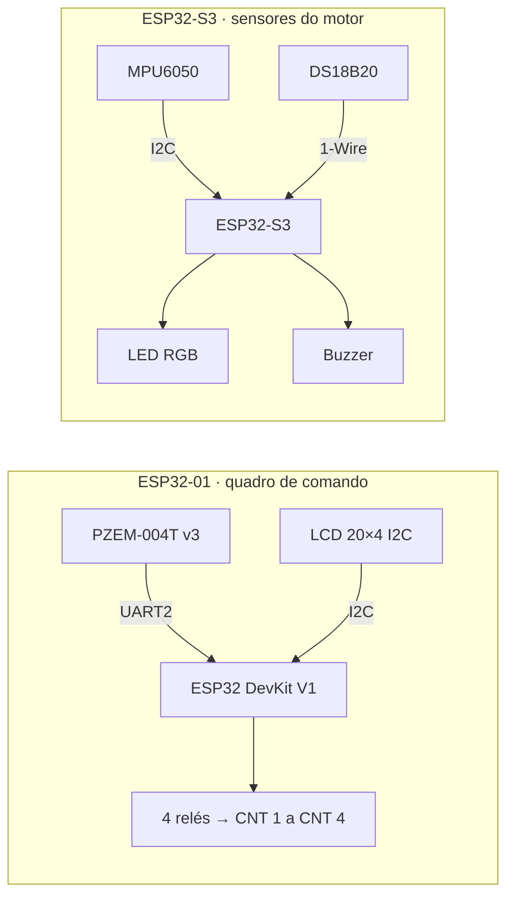

# Hardware

A bancada tem duas placas independentes. Cada uma fala com o broker por conta
própria, e uma pode funcionar sem a outra.

## Lista de materiais

| Item | Quantidade | Placa |
| --- | :---: | --- |
| ESP32 DevKit V1 (ESP32-WROOM-32) | 1 | Quadro de comando |
| Medidor PZEM-004T v3 (com TC) | 1 | Quadro de comando |
| Display LCD 20×4 com módulo I2C (PCF8574) | 1 | Quadro de comando |
| Módulo de 4 relés | 1 | Quadro de comando |
| Placa ESP32-S3 | 1 | Sensores do motor |
| Acelerômetro MPU6050 (GY-521) | 1 | Sensores do motor |
| Sensor de temperatura DS18B20 (à prova d'água) | 1 | Sensores do motor |
| Resistor 4,7 kΩ (pull-up do DS18B20) | 1 | Sensores do motor |
| LED RGB catodo comum + resistores | 1 | Sensores do motor |
| Buzzer passivo | 1 | Sensores do motor |

## Quadro de comando (ESP32-01)

| Elemento | Pino do ESP32 | Observação |
| --- | --- | --- |
| PZEM-004T TX | GPIO16 (RX2) | |
| PZEM-004T RX | GPIO17 (TX2) | |
| LCD SDA / SCL | GPIO21 / GPIO22 | Endereço `0x27`; a placa procura sozinha entre `0x20–0x27` e `0x38–0x3F` |
| Relé CNT 1 | GPIO19 | |
| Relé CNT 2 | GPIO18 | |
| Relé CNT 3 | GPIO23 | |
| Relé CNT 4 | GPIO27 | |

- Os relés são acionados em nível **alto**. Se o seu módulo liga em nível baixo, troque `RELE_ATIVO_EM_NIVEL_BAIXO` para `true` no sketch antes de gravar.
- As saídas começam **desligadas** a cada energização.
- **Estrela-triângulo:** a partida padrão usa CNT 1 como principal, CNT 2 como estrela e CNT 3 como triângulo, com 0,7 s de tempo morto entre estrela e triângulo.
- **Intertravamento:** estrela e triângulo fechados juntos são um curto entre fases. O tempo morto do firmware não basta: ligue um contato auxiliar NF de cada um na bobina do outro. O editor de partidas do painel pede confirmação quando uma partida deixa três contatores ligados ao mesmo tempo.
- O LCD não mostra acentos: o nome da partida sai sem acento só no display ("Estrela-triangulo"). No painel e no app o acento continua.

## Sensores do motor (ESP32-S3)

| Elemento | Pino do ESP32-S3 | Observação |
| --- | --- | --- |
| MPU6050 SDA / SCL | GPIO5 / GPIO9 | Endereço `0x68`, alimentação 3,3 V |
| DS18B20 DQ | GPIO4 | Pull-up de 4,7 kΩ para 3,3 V |
| Buzzer | GPIO42 | Passivo, acionado com `tone()` |
| LED azul / verde / vermelho | GPIO16 / GPIO17 / GPIO18 | Catodo comum |

- Se o DS18B20 não responder no GPIO4, a placa procura em outros pinos livres. Os pinos do LED e do buzzer ficam fora dessa busca.
- O MPU6050 é lido continuamente a **1000 amostras/s**. O firmware filtra a aceleração, integra numericamente para velocidade, filtra novamente para reduzir deriva e calcula a **velocidade RMS em mm/s** numa janela fixa de **1 s**, publicando o maior RMS entre X, Y e Z.
- A frequência de aquisição da vibração **não muda** quando o intervalo MQTT é alterado: apenas a cadência de publicação da telemetria muda.
- A temperatura é pedida a cada ~2 s, sem travar a comunicação.
- Sensores, LED e buzzer rodam numa tarefa separada da rede: o alarme continua funcionando sem Wi-Fi.

A cadeia completa, os filtros de 8 Hz, a integração, os critérios de validade, a faixa útil aproximada de 10–180 Hz e as recomendações de montagem estão em [**Vibração: medição, processamento e interpretação**](vibracao.md).

### O que o LED indica

| LED | Significado |
| --- | --- |
| Azul piscando | Conectando ao Wi-Fi ou ao broker |
| Azul fixo | Conectado, motor desligado |
| Verde fixo | Motor ligado, tudo normal |
| Vermelho piscando + buzzer | Motor ligado com alarme disparado |
| Vermelho fixo | Sensor sem leitura com o motor desligado |

Com o alarme geral desligado, o buzzer não toca e o vermelho não aparece.

### Buzzer sem som

Se o comando de bipe é aceito mas nada se ouve, o problema é de ligação ou de
alimentação. Depois de conferir os fios, mande o comando `buzzer_probe`
([referência](mqtt.md#comandos-dos-sensores-do-motor)):

1. A placa toca cada pino livre por 0,7 s, primeiro como buzzer passivo e depois como ativo.
2. Ela anuncia cada passo no `command_ack`.
3. No passo em que sair som, ajuste `BUZZER_PIN` no sketch. Se o buzzer for do tipo ativo, troque `tone()`/`noTone()` por `digitalWrite()`.

## Segurança elétrica

> [!CAUTION]
> Este é um projeto de **bancada didática**. Para acionar máquinas reais:
> - use parada de emergência independente, proteções elétricas e intertravamentos físicos;
> - lembre que `relays` na telemetria é o estado **comandado**, não a leitura de que o contator fechou;
> - confira o isolamento e a alimentação do PZEM-004T conforme o fabricante;
> - nunca faça ligações com o circuito energizado.
