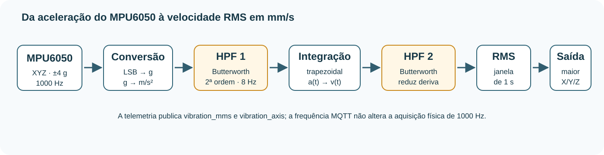
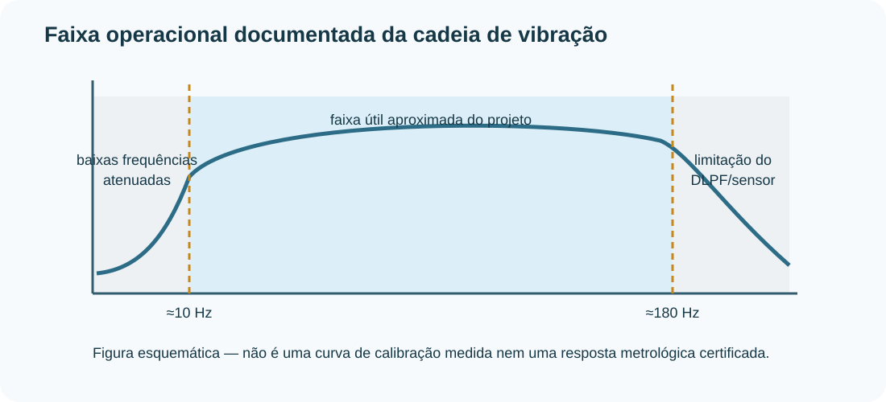
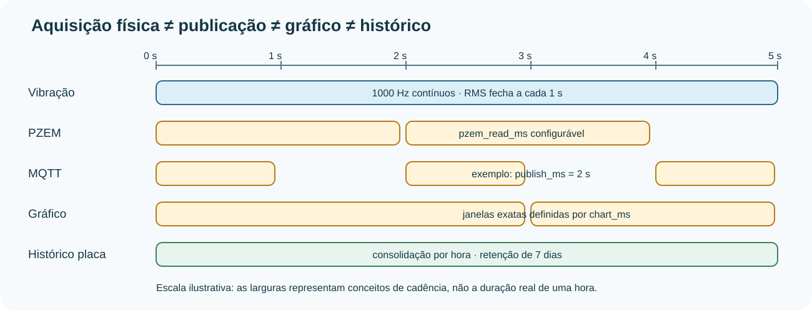
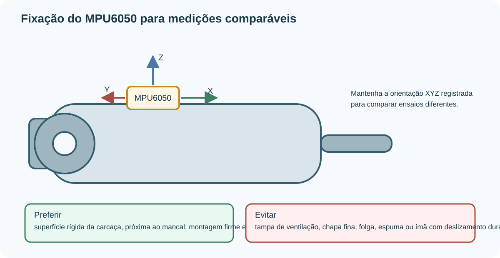
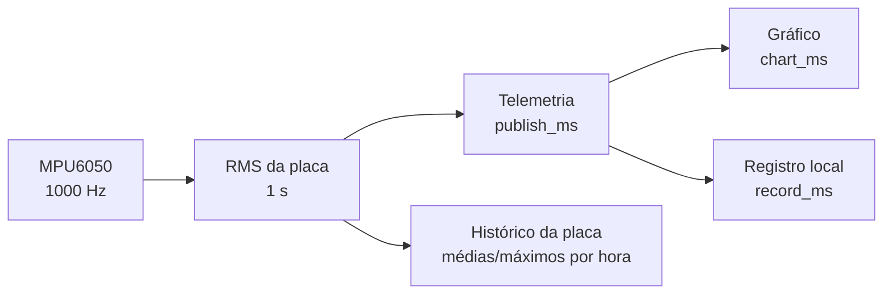

# Vibração: medição, processamento e interpretação

Este documento descreve **como o IoTMotor obtém a velocidade de vibração em
mm/s RMS a partir do MPU6050**, quais filtros e critérios de validade são
aplicados, como o valor chega ao painel/app e quais são as limitações práticas
da medição.

> [!IMPORTANT]
> O IoTMotor é uma plataforma didática e de pesquisa. A medição é útil para
> acompanhamento de tendência, comparação entre ensaios e detecção de mudanças
> de condição, mas **não substitui um analisador de vibração calibrado nem uma
> avaliação formal de conformidade com norma técnica**.

## Visão geral



A cadeia implementada no ESP32-S3 é:

```text
MPU6050
  ↓  1000 amostras/s · XYZ · ±4 g
leitura bruta
  ↓
LSB → g → m/s²
  ↓
passa-altas Butterworth 2ª ordem · 8 Hz
  ↓
integração (Al-Alaoui)
  ↓
velocidade em m/s
  ↓
passa-altas Butterworth 2ª ordem · 8 Hz
  ↓
RMS de 1 s em X, Y e Z
  ↓
maior RMS dos três eixos
  ↓
× 1000
  ↓
vibration_mms + vibration_axis
```

O código responsável está em
[`vibracao.h`](../esp32/iotmotor_esp32/iotmotor_esp32_s3_sensores/vibracao.h).

## Parâmetros implementados

| Parâmetro | Valor atual | Onde aparece no firmware |
| --- | ---: | --- |
| Frequência de amostragem | 1000 Hz | `TAXA_HZ` |
| Fundo de escala | ±4 g | registro `ACCEL_CONFIG = 0x08` |
| Sensibilidade usada | 8192 LSB/g | `LSB_POR_G` |
| Aceleração da gravidade | 9,80665 m/s² | `G` |
| Passa-altas | Butterworth, 2ª ordem | `PassaAltas` |
| Corte de cada passa-altas | 8 Hz | `CORTE_HZ` |
| Janela RMS | 1 s | fechamento em `tarefaSensores` |
| Amostras de assentamento | 300 | `AMOSTRAS_ASSENTAR` |
| Mínimo para uma janela válida | 500 | `MINIMO_JANELA` |
| Validade do último RMS | 3 s | `MMS_VALIDADE_MS` |
| DLPF MPU6050 | ~184 Hz | `CONFIG = 0x01` |
| Saída | maior RMS entre X/Y/Z | `fecharJanela()` |

Para dispositivos compatíveis que respondem com outro `WHO_AM_I` e usam o
registro específico do acelerômetro, o firmware também configura o filtro
correspondente (~218 Hz no caminho implementado).

## 1. Aquisição pelo MPU6050

O MPU6050 é configurado para colocar **somente os três eixos do acelerômetro**
na FIFO. Cada amostra ocupa 6 bytes:

```text
AX_H AX_L AY_H AY_L AZ_H AZ_L
```

O divisor de amostragem fica em zero e o DLPF é habilitado, produzindo uma taxa
de **1000 amostras/s**.

A FIFO é esvaziada continuamente pela tarefa de sensores, separada das
operações de rede. Isso evita que uma operação MQTT lenta determine a taxa
física da medição.

## 2. Conversão de leitura bruta para aceleração

Com o acelerômetro em ±4 g, o projeto usa:

```text
8192 LSB = 1 g
```

Para cada eixo:

$$
a_g[n] = \frac{raw[n]}{8192}
$$

e:

$$
a[n] = a_g[n]\cdot 9{,}80665
$$

onde $a[n]$ passa a estar em **m/s²**.

Essa conversão ocorre independentemente em X, Y e Z.

## 3. Primeiro filtro passa-altas

Antes da integração, cada eixo passa por um **Butterworth passa-altas de
segunda ordem**, com:

- frequência de amostragem: 1000 Hz;
- frequência de corte configurada: 8 Hz;
- transformação bilinear.

A equação de diferenças implementada é:

$$
y[n] = b_0x[n]+b_1x[n-1]+b_2x[n-2]-a_1y[n-1]-a_2y[n-2]
$$

Para 8 Hz / 1000 Hz, os coeficientes calculados pelo próprio algoritmo são
aproximadamente:

| Coeficiente | Valor |
| --- | ---: |
| $b_0$ | 0,965081 |
| $b_1$ | -1,930162 |
| $b_2$ | 0,965081 |
| $a_1$ | -1,928942 |
| $a_2$ | 0,931382 |

A finalidade principal desse estágio é reduzir:

- gravidade;
- inclinação estática;
- deriva muito lenta;
- componentes abaixo da faixa de interesse do projeto.

## 4. Integração da aceleração para velocidade

A velocidade não é obtida multiplicando a aceleração por um número fixo.
O firmware faz **integração numérica no tempo**.

É usado o integrador de **Al-Alaoui** (`s3-sensors-1.22` em diante):

$$
v_i[n] = v_i[n-1] +
\frac{7\,a[n]+a[n-1]}{8}\Delta t
$$

com:

$$
\Delta t = \frac{1}{1000}=0{,}001\;s
$$

Portanto, a saída da integração está em **m/s**.

Até a `s3-sensors-1.21` o firmware usava o **trapézio**
($\frac{a[n]+a[n-1]}{2}\Delta t$). Os dois custam o mesmo, mas o trapézio a 1 kHz
perde ganho nas frequências altas, e a leitura saía abaixo do valor real. O de
Al-Alaoui mantém o erro pequeno em toda a faixa útil:

| Frequência | 30 Hz | 60 Hz | 120 Hz | 150 Hz | 180 Hz |
| --- | ---: | ---: | ---: | ---: | ---: |
| Trapézio (até 1.21) | −0,3 % | −1,2 % | −4,8 % | −7,5 % | −10,9 % |
| Al-Alaoui (1.22 em diante) | 0,0 % | −0,2 % | −0,7 % | −1,0 % | −1,3 % |

Em 1× e 2× a rotação de motores de 2 e 4 polos (até ~120 Hz) a diferença entre
os dois é pequena; o histórico de 7 dias pode misturar dias medidos pelos dois
métodos sem mudar a classificação. Os testes nativos do firmware
(`esp32/testes_nativos/teste_vibracao.cpp`) conferem essa resposta com
senoides conhecidas.

### Por que não converter diretamente g → mm/s?

Aceleração e velocidade são grandezas diferentes. Para uma senoide pura seria
possível relacioná-las se a frequência fosse conhecida:

$$
V_{RMS}=\frac{A_{RMS}}{2\pi f}
$$

mas a vibração real contém várias componentes ao mesmo tempo. Por isso o
IoTMotor integra o sinal amostrado no domínio do tempo.

Como verificação de ordem de grandeza, uma senoide de **1 mm/s RMS a 30 Hz**
corresponde a aproximadamente **0,1885 m/s² RMS**, ou **0,0192 g RMS**.

## 5. Segundo passa-altas: controle da deriva

Integração numérica amplifica o efeito de pequenos offsets. Mesmo um erro DC
muito pequeno pode fazer a velocidade integrada crescer artificialmente.

Por isso, após a integração, a velocidade passa por **outro Butterworth
passa-altas de 2ª ordem a 8 Hz**.

Os dois passa-altas têm papéis diferentes:

| Estágio | Atua sobre | Objetivo principal |
| --- | --- | --- |
| HPF 1 | aceleração | remover gravidade e baixa frequência antes de integrar |
| HPF 2 | velocidade integrada | impedir deriva acumulada da integral |

O resultado é uma cadeia voltada à **vibração dinâmica**, e não a movimento
quase estático.

## 6. Cálculo RMS

Durante cada janela de aproximadamente 1 s, o firmware acumula, por eixo:

$$
S_x=\sum v_x^2,\quad
S_y=\sum v_y^2,\quad
S_z=\sum v_z^2
$$

Ao fechar a janela:

$$
V_{x,RMS}=\sqrt{\frac{S_x}{N}}
$$

e de forma equivalente para Y e Z.

Como a velocidade está em m/s, a conversão final é:

$$
V_{RMS,mm/s}=1000\cdot V_{RMS,m/s}
$$

O firmware publica como `vibration_mms` o **maior valor RMS da janela**:

$$
V_{pub}=\max(V_{x,RMS},V_{y,RMS},V_{z,RMS})
$$

e informa em `vibration_axis` qual eixo produziu esse valor.

> [!NOTE]
> A escolha do maior eixo é uma decisão conservadora do projeto para representar
> a direção mais vibrante do ponto de medição. Ela não transforma, por si só, o
> sistema em um instrumento certificado segundo ISO.

## 7. Qualidade e validade da janela

O firmware não aceita qualquer sequência de amostras como medição válida.

| Situação | Tratamento |
| --- | --- |
| Inicialização/reinício dos filtros | primeiras 300 amostras são descartadas |
| Janela com menos de 500 amostras úteis | não gera velocidade válida |
| Valor não finito | amostra rejeitada |
| Magnitude dinâmica vetorial ≥ 8 g | amostra rejeitada como anômala/corrompida |
| FIFO cheia ou próxima de 1024 bytes | contabiliza perda, zera FIFO e reinicia filtros |
| Falha de leitura I2C | MPU é marcado como indisponível e será reinicializado |
| RMS sem atualização válida por 3 s | valor deixa de ser considerado atual |

Quando a FIFO perde amostras, continuar integrando produziria uma velocidade
inconsistente. Por isso o firmware reinicia a cadeia e volta a descartar as
amostras iniciais até os filtros assentarem.

## 8. Faixa de frequência



O projeto trabalha, de forma prática, com uma faixa aproximadamente útil de
**10 Hz a 180 Hz**.

O limite inferior decorre do tratamento passa-altas. O limite superior é
determinado pelo DLPF/configuração do MPU e pela cadeia adotada.

Essa banda é suficiente para muitos fenômenos de baixa frequência ligados à
rotação de motores usados em bancada, mas **não cobre toda a banda usada por
instrumentos industriais para diagnóstico de rolamentos, engrenagens e
componentes de alta frequência**.

A figura é esquemática e não deve ser interpretada como curva de calibração
medida.

## 9. Aquisição física e publicação são coisas diferentes



A vibração continua sendo adquirida a **1000 Hz**, mesmo se o usuário configurar
a publicação MQTT para 2 s, 5 s ou outro valor permitido.

| Processo | Cadência |
| --- | --- |
| MPU6050 | 1000 Hz, fixa |
| Janela RMS da vibração | 1 s, fixa |
| Temperatura DS18B20 | solicitação ~2 s |
| PZEM | `pzem_read_ms` |
| Telemetria MQTT | `publish_ms` |
| Pontos dos gráficos | `chart_ms` |
| Registro local | `record_ms` |
| Histórico consolidado da placa | 1 h |
| Retenção do histórico | 7 dias |

Assim, diminuir a taxa MQTT **não reduz a qualidade da aquisição física da
vibração**; apenas reduz quantas atualizações são enviadas às interfaces.

## 10. Montagem do sensor



A montagem mecânica faz parte da cadeia de medição. Uma fixação flexível ou
com folga pode atenuar, amplificar ou criar ressonâncias que não pertencem ao
motor.

Para ensaios comparáveis:

- prefira uma região rígida da carcaça e, quando possível, próxima ao mancal;
- evite tampa da ventoinha, chapa fina e superfícies que flexionam;
- reduza ao mínimo a camada entre o sensor e o metal;
- garanta que o case não deslize, balance ou bata durante o ensaio;
- registre a orientação X/Y/Z;
- use sempre o mesmo ponto e orientação ao comparar medições;
- se a fixação for magnética, dimensione força normal e resistência ao
  deslizamento com margem para a vibração e para o peso do conjunto.

A ISO 20816-3 trata de medições in-situ em eixos, mancais, pedestais ou
carcaças de máquinas dentro do seu escopo; portanto, o ponto de montagem deve
ser documentado quando se pretende comparar resultados com referências
normativas.

## 11. Classificação mostrada no painel e no app

O IoTMotor possui quatro rótulos operacionais:

- **Boa**
- **Aceitável**
- **Alerta**
- **Crítica**

O código atual usa estas faixas:

| Potência cadastrada | Boa | Aceitável | Alerta | Crítica |
| --- | ---: | ---: | ---: | ---: |
| até 15 kW | < 0,71 | 0,71 a < 1,8 | 1,8 a < 4,5 | ≥ 4,5 mm/s |
| >15 até 75 kW | < 1,12 | 1,12 a < 2,8 | 2,8 a < 7,1 | ≥ 7,1 mm/s |
| acima de 75 kW | < 1,8 | 1,8 a < 4,5 | 4,5 a < 11,2 | ≥ 11,2 mm/s |

Esses limites devem ser entendidos como **faixas de referência implementadas no
projeto**, úteis para visualização e alarmes.

> [!WARNING]
> Não trate os rótulos do IoTMotor como laudo ou certificação ISO. A edição
> publicada da ISO 20816-3 possui escopo próprio para máquinas industriais
> acima de 15 kW, além de condições de montagem, operação e avaliação que não
> são automaticamente satisfeitas por uma bancada com MPU6050. Para avaliação
> normativa formal, consulte a edição vigente da norma, a classe da máquina,
> o ponto de medição e um instrumento adequado.

## 12. Validação experimental recomendada

Antes de usar valores absolutos como critério de manutenção, recomenda-se
validar o conjunto **sensor + case + fixação + firmware**.

### Etapa A — inspeção estática

1. motor parado;
2. sensor rigidamente instalado;
3. observar estabilidade e ausência de saltos;
4. repetir após retirar e reinstalar o case.

O objetivo não é exigir exatamente 0,00 mm/s, mas verificar estabilidade,
ruído e repetibilidade da montagem.

### Etapa B — repetibilidade

Faça pelo menos três ensaios nas mesmas condições de:

- rotação;
- carga;
- ponto de montagem;
- orientação;
- duração.

Registre média, máximo e dispersão.

### Etapa C — comparação com instrumento de referência

Quando disponível, fixe um vibrômetro/acelerômetro de referência próximo ao
MPU6050 e compare em vários pontos de operação.

Erro relativo:

$$
erro_{\%}=100\cdot
\frac{|V_{IoTMotor}-V_{ref}|}{V_{ref}}
$$

Não se deve adotar um limite de erro genérico sem definir antes o objetivo do
ensaio e o instrumento de referência.

### Etapa D — validação por frequência conhecida

Com excitador/shaker ou outra fonte controlada, testar vários pontos dentro da
banda de interesse permite verificar:

- ganho em função da frequência;
- efeito da fixação;
- ruído de fundo;
- proximidade dos limites de 10 Hz e 180 Hz.

## 13. O que registrar em um ensaio

Para tornar os resultados reproduzíveis, registre:

| Grupo | Informação |
| --- | --- |
| Motor | potência, tensão, corrente, rotação nominal, ligação |
| Operação | rotação real, carga, partida, duração |
| Sensor | placa, orientação XYZ, firmware |
| Montagem | ponto na carcaça, tipo de fixação, case |
| Aquisição | 1000 Hz / RMS 1 s |
| Comunicação | `publish_ms`, `chart_ms`, `record_ms` |
| Resultado | mm/s RMS, eixo dominante, temperatura, corrente |
| Contexto | data, observações, manutenção recente |

## 14. Diagnóstico e limitações

Um único valor global em mm/s é ótimo para **severidade e tendência**, mas não
identifica sozinho a causa da vibração.

| Pergunta | O valor RMS global responde? |
| --- | --- |
| A vibração aumentou? | Sim, em geral |
| Qual eixo está pior? | Sim, por `vibration_axis` |
| O motor mudou de condição? | Pode indicar |
| É desbalanceamento ou desalinhamento? | Não de forma conclusiva |
| Há defeito específico de rolamento? | Não |
| Qual frequência está dominante? | Não; o espectro (`vib.*.pk_hz`, seção 17) responde |
| O instrumento atende formalmente uma norma? | Não sem validação metrológica e procedimento adequado |

Desde a `s3-sensors-1.23`, cada janela também traz o diagnóstico por eixo e o
espectro da velocidade (seção 17), mantendo o RMS global como indicador de
severidade.

## 15. Dados enviados por MQTT

Exemplo:

```json
{
  "device_id": "esp32-02",
  "vibration_mms": 1.34,
  "vibration_axis": "y",
  "sample_count": 997,
  "mpu_ok": true
}
```

- `vibration_mms`: maior velocidade RMS entre X/Y/Z;
- `vibration_axis`: eixo correspondente;
- `sample_count`: quantidade de amostras úteis da última janela;
- `mpu_ok`: sensor respondendo.

Veja a [Referência MQTT](mqtt.md#telemetria-dos-sensores-do-motor).

## 16. Relação com o histórico e os gráficos

O RMS de 1 s é calculado na placa. A partir daí:



Os gráficos não devem fabricar pontos intermediários. Quando várias amostras
reais pertencem à mesma janela de gráfico, a interface as consolida na janela
temporal correspondente.

## 17. Diagnóstico por eixo e espectro

Para **detecção e classificação de falhas**, um número só não basta: cada
falha deixa uma assinatura diferente. Desde a `s3-sensors-1.23`, a cada janela
de 1 s a placa publica, por eixo, o objeto `vib` (formato na
[Referência MQTT](mqtt.md#telemetria-dos-sensores-do-motor)).

### Estatísticas da aceleração

Calculadas sobre a aceleração **depois do primeiro passa-altas** (sem a
gravidade), nas mesmas amostras válidas da janela RMS:

| Grandeza | Conta | Senoide pura | Para que serve |
| --- | --- | ---: | --- |
| `a_rms` | $\sqrt{\sum a^2 / N}$ | — | Energia total em aceleração |
| `a_peak` | $\max \lvert a \rvert$ | — | Maior valor da janela |
| `crest` | $a_{peak} / a_{rms}$ | 1,41 | Impactos (folga, batida) sobem |
| `kurt` | $N \sum a^4 / (\sum a^2)^2$ | 1,5 | 3 em ruído aleatório; impactos passam disso |

### Espectro da velocidade

A placa guarda as últimas **1024 velocidades** de cada eixo e, ao fechar a
janela, faz uma **FFT de 1024 pontos com janela de Hann** (resolução de
~0,98 Hz). Do espectro saem:

- **17 faixas de 10 Hz** (`bands`), centradas em 20, 30, … 180 Hz, com bordas
  em 15, 25, … 185 Hz. As bordas ficam longe de 60 e 120 Hz (rede e 2× rede)
  e de 1× e 2× a rotação de motores de 2 e 4 polos, que caem no meio de uma
  faixa. Cada faixa é a velocidade RMS ali, em mm/s, pela relação de Parseval
  com a janela:

  $$
  V_{faixa}=1000\sqrt{\frac{2}{N\sum w^2}\sum_{k\in faixa}\lvert X_k\rvert^2}
  $$

- o **pico dominante** entre 10 e 185 Hz: frequência (`pk_hz`, com
  interpolação parabólica entre linhas) e velocidade RMS (`pk_mms`, somando as
  3 linhas em que a janela de Hann espalha um tom).

Para um sinal estacionário, a soma quadrática das faixas se aproxima do `mms`
do eixo. Os testes nativos (`teste_vibracao.cpp`) conferem com senoides
conhecidas: 60 Hz cai na faixa de 60 Hz, um tom de 29,5 Hz (entre duas linhas)
dá o pico em 29,5 Hz, e dois tons caem em faixas separadas.

### O que cada assinatura costuma indicar

| Assinatura | Causa provável |
| --- | --- |
| Faixa de 1× a rotação alta, radial | Desbalanceamento |
| 2× a rotação alta, em especial axial | Desalinhamento |
| Várias harmônicas da rotação, crista e curtose altas | Folga mecânica |
| 120 Hz (2× a rede) alto | Origem elétrica (entreferro, desequilíbrio de fase) |

A tabela é orientativa. O modelo de classificação aprende as assinaturas reais
da sua bancada com os ensaios rotulados.

### Limites

- A faixa continua sendo **10 a ~180 Hz** (filtro do MPU6050). Defeitos de
  rolamento em estágio inicial aparecem em kHz e **não** são vistos.
- O espectro só sai depois de 1024 amostras seguidas (~1 s após ligar ou após
  uma perda na FIFO).
- A FFT roda na tarefa dos sensores, a cada 1 s, em precisão simples: 3 FFTs
  levam poucos milissegundos no ESP32-S3, bem menos que os ~170 ms que a FIFO
  do MPU aguenta.

## 18. Referências técnicas

- [ISO 20816-3 — Mechanical vibration — Measurement and evaluation of machine vibration — Part 3](https://www.iso.org/standard/78311.html). Consulte a edição vigente antes de qualquer avaliação normativa formal.
- [Analog Devices — MEMS Vibration Monitoring: From Acceleration to Velocity](https://www.analog.com/en/resources/analog-dialogue/articles/mems-vibration-monitoring-acceleration-to-velocity.html). Referência conceitual sobre conversão de aceleração para velocidade e limitações de banda/ruído.
- Firmware do projeto: [`vibracao.h`](../esp32/iotmotor_esp32/iotmotor_esp32_s3_sensores/vibracao.h).

## Resumo técnico

```text
1000 Hz, XYZ, ±4 g
      ↓
8192 LSB/g
      ↓
m/s²
      ↓
HPF Butterworth 2ª ordem, 8 Hz
      ↓
integração de Al-Alaoui, Δt = 1 ms
      ↓
m/s
      ↓
HPF Butterworth 2ª ordem, 8 Hz
      ↓
RMS de 1 s
      ↓
maior eixo
      ↓
mm/s RMS
```
